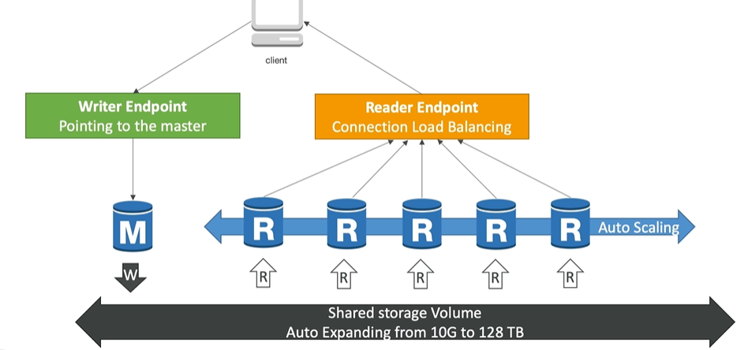

# Aurora
## Design
- engine : `Postgres` and `MySQL`
- 20% extra cost than RDS.
- `scaling`: 
  - vertically : 10GB to 128TB
- `performance`:
  - AWS cloud optimized and claim `5x` Performance improvement.
  - master + 15 Read Replica, with fast replication.
- `Availability`
  - `6 copies` for data access 3 AZ
  - instant fail-over (<30s) + `self healing` from peer2peer replication.
  - 
  - 
---
## more:
  - Backup/`snapshot` and Recovery
  - Isolation and `security`
  - `Industry compliance`
  - Push-button `scaling`  
  - Advanced Monitoring
  - Routine `Maintenance` + Automated `Patching` with Zero Downtime
  - Backtrack: `restore` data at any point of time without using backups