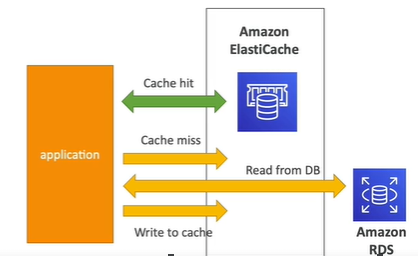

# ElastiCache
- AWS Types/offering :  `Redis` vs `MemCache`
- cache use-cases :
  - a. `Database`
    - prg <--- DB (state)
    - prg (`code` changes to use cache ) <--- `Cache` <--- DB(Data) : for stateless Application
      - `low latency`
      - `high performance`
      - `reduce load` off of databases for read intensive workloads
      - 
      - lazy loading(stale read) and write-through(sync cache with DB)
  - b. Maintain user Session
    - 
---
##  A. Redis 
- think of RDS, similar.
- internal: 
  - uses `Sets`(uniqness) and `SortedSets` (uniqueness + ordering)
  - `cluster` > `shard`(node group) > `node`(cache)
  - One primary Node (choose: ec2 intance type)
  - select upto 5 Read `Replicas` to scale reads and have high availability
  - enable/disable: `Multi AZ` with Auto-Failover, more cost.
    - Read replica-1 --> az-1
    - Read replica-2 --> az-2, etc

- Backup/restore : y/n
- Security:
  - apply `IAM roles/policies`
  - create `redis password/token` after cluster creation
  - Add `sg` : which app will have acces from n/w perspective.
  - `encryption` at rest + fly(SSL)


## B. MemCache
- No high availability (replication)
- `Non persistent`
- No backup/restore
- Multi-threaded architecture ?
- Multi-node for partitioning of data (sharding) ?
- Security:
  - `SASL` (more advance)

--- 

- Redis Demo:
```
- Create REDIS (.rdb file)
- Choose : Design youe own cache
    - method : Easy, cluster cache ** , restore(from .rdb)
    - cluster name, password, port
    - maintenece window
    - security : encryption (rest /fly)
    - enable logs
    - tags
    - VPC/subnet
    - redis Engine : vesrion, ec2 instance type, count of Read replica
    
    === READY ===
    
    - primary end point
    - reader end point
    - backup/restore
    
```