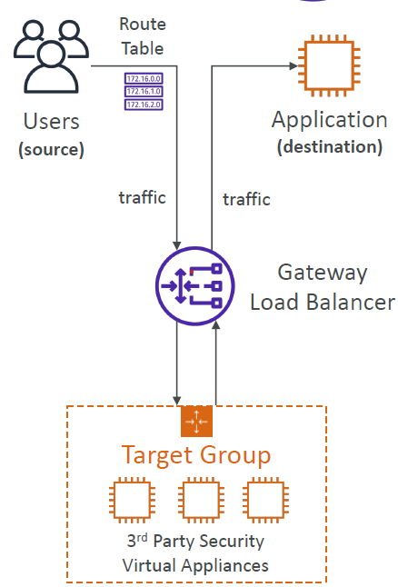
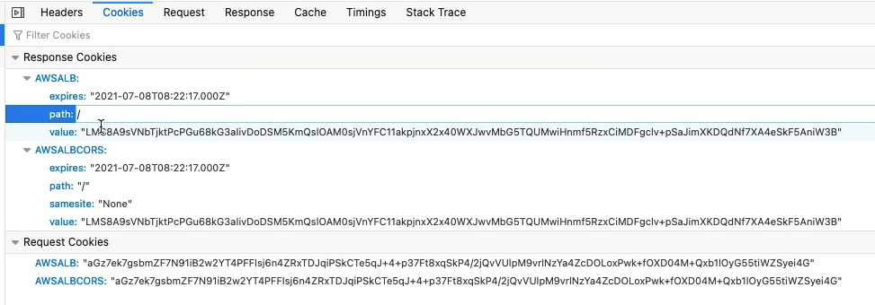

- https://chatgpt.com/c/b1fe7e08-270f-4a92-a4db-b95e6beab7c7
---
## A. keys Terms
- `Availability` : multi AZ, prevent datacenter loss
- `Scalability`:
    - `horizon` scaling(elasticity) / `Distributed system`
        - scale in and out
    - `vertical` scaling
        - scale up and down.
- `load balancing` : gateway | forwards traffic to healthy servers. 
- `Sticky Sessions` : 
  - Client always redirect to same instance, in order to not lose his session data.
  - might bring some imbalance.
  - cookies: 
    - `LB generated` / Duration-based? : uses these reserved name: `AWSALB, AWSALBAPP, AWSALBTG`
    - `Application (TG) based` : MY_TG_1_COOKIE, etc
- SSl-old/TLS-new.
  - `X.502` === TLS certificate (private key, bodt, chain)
  - ccgg uses `digicert` as `CA`.
  - `SNI` : resolves multiple certificate load problem.
  - encrypt `in-fly` traffic.
---
## B. AGS
- client --> ELB --> TG --> ASG [ec2-i1, ...]
- scaling policies : in/out:
  - `Dynamic`: CloudWatch --> metric(CPU,memory,network, `custom`, `RequestCountPerTarget`) --> `alarm` --> ASG --> scale out
    - `target tracking Scaling` : CPU,memory,network utilization
    - `Simple scaling`
    - `Step scaling`
  - `scheduled` : eg: scale d`on to min count on weekends.
  - `predictive` : 
    - continuously forecast load and schedule scaling ahead.
    - Easy to create. once created ait for Week. ML will be applied on historic data.
- `Launch template` : EC2 details (AMO,OS, Role, etc)
- if ELB / health fail, ASG wil terminate instances.
- During `cool-down effect`, ASG does not add new instances.
- Check AWS Activity history.
- demo : create one and link with tg. count : `desired, min, max`

---
## C. ELB
- regional, forwards traffic to multiple ec2 in different AZ
  - with/without `Cross-Zone Load Balancing` : Enabled by default, `free`
    - if az-1 has more instances running, most traffic must go there. 
- works in conjunction with `ASG`.
- has/contains :
  - health-check mechanism (/health) at `target-group` level
  - has `DNS` name, `XXXX.region.elb.amazonaws.com` , IP might change.
  - Security group : sg-lb-1
    - Also, add rule to SG of ec2 instance to allow traffic sg-lb-1
  - integration with ACM : [cert-1 for domain-1, cert-2 for domain-2, ... ] : `SNI` helps to load single Cert.
- Since `complex`, already configured and integrated with other AWS services.
  - route 53, ASG, EC2, Certificate manager 
  - ECS, EKS
  - Cloudwatch, WAF, Global-Accelerator
- purpose:
  - gateway | forwards traffic to healthy servers.
  - separate `public-traffic` from `private-traffic`, can create public and private LB.
  - provide `TLS/SSL-termination`
    - allowing it to decrypt and inspect incoming traffic before forwarding it to the backend instances.
    - already integrated with `ACM`.
  - Enforce `stickiness with cookies` ?
- Types:
  - `Classic` CLB (deprecated)
  - `ALB` : operate at layer 7 : HTTP,HTTPS, websocket
  - network, `NLB` : operate at layer 4: TCP, UDP, TLS : `very low latency, fast`
  - gateway : `GWLB`, 2020 : provides advance security

---
### C.1. ELB : ALB - Application LB (layer 7)
- `client` (IP-1) --https--> `ELB` with ACM (add extra header in http : `X-forwarded-for`) --http--> `app-server`
  - notice https vs http
- client >> ELB >> [ tg, redirect, fixed-http-response ]
- tg / `target groups`:
  - Types:
    - LB >> tg [EC2-I1, EC2-I3,...] : `VM`
    - LB >> tg [VM-1 [docker-1, docker-2, ...]] : `containers`
    - LB >> tg [lambda-1, lambda-2]
    - LB >> tg [ip address] : `on-prem server IPs`
  - Also, LB >> tg-1, tg-2, ... multilpe tg is possible.
  - routing/forwarding can happen at `route/path/url` ,` query-param `
    - eg: /url-1?`plateform=mobile` --> tg-1
  - demo:
      ```
      - Launch `ec2-i1` and `ec2-i2`, add sg-1 to both.
        - sg-1 : allow traffic ONLY from below `elb-sg-1` 
      - create target group - `tg-1` + /health/ + http:80
      - Creat ELB - elb-1, elb-dns-1
        - choose AZs
        - add `elb-sg-1` : all public traffic
        - add Listener & Routing :  
          - Listener-1::No-contion : outside traffic on http:80  --> forward to --> `tg-1` 
          - Listener-1::consition-1 (priority-100) : path, header, queryparam, etc. [TRY] --> tg-x
          - Listener-2::No-Condition (priority-200)  on https:443 --> forward to --> tg-2 + make sure ACM has Cert for tg-domian.
          - ...
          - ...  
          - Note:rule with higestest priorty win  
        - hit dns-1
        - terminate ec2-i1 and hit elb-dns-1 again.
      ```
- `Connection Draining` / `registration delay`
  - default 5min : allow 5 min to drains
  - make 0 to disable
  - if low like 5sec, then ec2-i will terminate fast, and all active clients session might lost,
  - and assign to new instance on subsequent req.
---
### C.2. ELB : NLB - Network LB (layer 4)
- operates at layer 4:  handle TCP, UDP, and TLS traffic
- TLS traffic: decrypt message using ACM cert.
- Similar to ELB but fast, handles `millionsOfReq/Second`. ultra-low latencies.
  - It `automatically scales` to handle the vast amounts of incoming traffic
- `use-case`:
  - applications that need fixed IP addresses. `AWS assign static-IP to ALB, one for each AZ`.
  - ideal for TCP/UDP Applications.
  - microservices architectures.
  - gaming and streaming services.

- target group:
  - ELB
  - EC2 instances
  - IP Addresses
- `health-check` support multiple-protocol : `http,https,TCP`
- demo : similar as above
- Cross-Zone Load Balancing : disable by default, pay

---
### C.3. ELB : GWLB - gateway LB (layer 3)
- (layer 3 of OSI) IP packets.
- all traffic --> GWLB --> TG (3rd party security instance) --> Application/ destinition
- 3rd party `security` instance:
  - `Deep packet inspection`
  - `payload manipulate`.
- uses protocol-GENEVE, port-6081 ?
- Cross-Zone Load Balancing : disable by default, pay


--- 
## Z. Screeshots
> credit: https://www.udemy.com/course/aws-certified-solutions-architect-associate-saa-c03/





