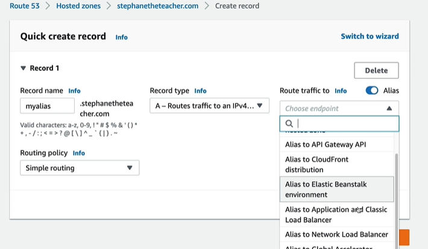
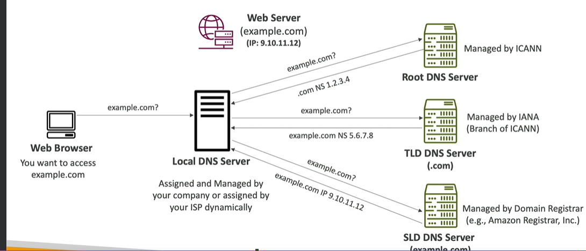

# Route 53
- only service provide : 100% availability
- 53 is reference tradition DNS port
---
## A. Key term
- `DNS` (hostName <--> IP) , `DNS-registrar`
- `Name Server` : server actually resolve `DNS queries`
- `Zone file` >> has `DNS Record` (types - A, AAAA, CNAME, etc).
- DNS Records type
  - `A : domain -> IPv4` 
  - `AAAA : domain -> Ipv6` 
  - `CNAME : domain -> doanother Domain (except root/TLD)`
    - eg: xxxx.us-east-1.alb.com --> my-elb.com
  - `NS : domain -> Name Server`
  - `Alias` (AWS specific) - benefit : free + native health-check
    - domain --> aws resources (ELB, CloudFront, `API-gateway`, s3, `VPS-interafceEndpoint`, `Global-Accelerator`, `ElasticBeanstalk`)
    - domain --> CAN NOT [ec2 DNS name] **
    - domain --> root domain (works) :)
    - Configuring TTL not allowed, set bt R53.
    - Alias === [ A or AAAA + flag:alias=True ]
    - 
  -  `advanced`:   [ CAA / DS / MX / NAPTR / PTR / SOA / TXT / SPF / SRV ]

- `TTL` :
  - client cache the result from DNS server, for that that period locally.
  - hence wont query again till TTl expire.
  - eg: 24 hr, 60 sec
  - Domain/subdomain Name (example.com) + value (11.22.33.44)

- `namespace` : root domain, top level domain, second level domain, sub domain, FQDN, URL :
  - 
  
- `DNS Working` : notice multiple queries
  - 
---

## B. Features 
- Fully managed : `DNS-registrar` + `Name server` (resolves queries)
- `AWS : Hosted Zone`
    - `Container` for DNS Record/s
    - define `traffic routing` for domain, its sub-domains.
    - Type:
        - `public` : internet traffic, return ( public IP + TTL)
        - `private`  : internal traffic within VPC, return ( private IP + TTL)
    - cost : .50/m 
  
- `Routing policy`: 
  - 

- Demo :
```
- launch Ec2-i1, i2, and i3  (in az1, az2,az3), with simple webapp
- create ALB
    - `alb-1-dns` : hostname/domainname
    - choose az1, az2, az3
    - create TG (tg-1)
        - sg : allow all HTTPs traffic
        - AZ1, az2, az3
        - regsister Ec2-i1, i2, and i3
    - routing and filter: 
        - Listener-1::No-contion : outside traffic on `http:80`  --> forward to --> `tg-1` 

- create hosted Zone  [Zone : hz.com ]
  - NS hz.com -> *****, ****, ****, **** some entry comes automatically once HZ created : alrady present
  - A + alias:F, ec2-1.com ->   ec2-1 public IP  
  - A + alias:F, ec2-2.com ->   ec2-2 public IP 
  - A + alias:F, ec2-3.com ->   ec2-3 public IP 
  - CNAME        abl.com --> alb-1-dns
  - A + alias:T, abl-alias.com --> now can provide another domain --> alb-1-dns ; FREE
  - CNAME        hz.com -->   alb-1-dns : ERROR
  - A + alias:T, hz.com --> alb-1-dns : WORKS
  
- acess webapp:
  - diectly from ec2-i public IPS
  - add (A + alias:F) record and access
  - via ELB 
    - alb-1-dns
    - abl-alias.com
  - hz.com
```
---
## Screenshot:
> credit: https://www.udemy.com/course/aws-certified-solutions-architect-associate-saa-c03/

- 