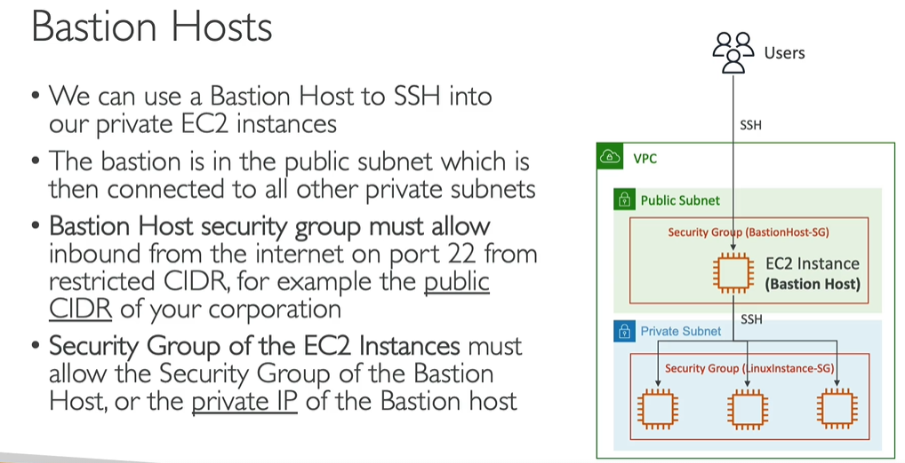
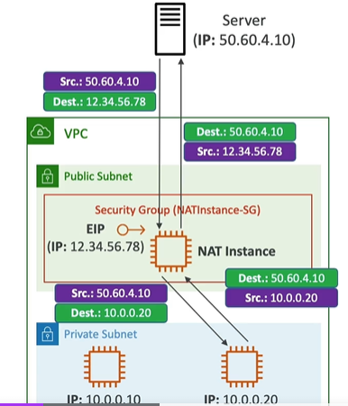

# VPC-2

## 1. access ec2-i in private subnet
### 1.1. bastion host : SSH 
- access ec2-i in private subnet from  [ public-subnet(has routing to igw-1) > `bastion ec2-instance` ]
- just update SGs:
  - sg-bastion : inbound : source:MyPublicIP, to port 22(SSH) --> so that I can SSh from my laptop
  - sg-ec2-i : inbound : CUSTOM >> source:sg-bastion, to port 22(SSH) **
    - 
    - demo:
      - my-laptop/client  -> ssh to bastion (running inside public-subnet)
      - In bastion, add `keypair` for private ec2-i.
      - From bastion,  SSH to private ec2

---
### 1.2. NAT instance : https / http
- > outdated,after 2020 : use NAT-gateway 
- internet access:
  - way-1 : internet:(abc.com/Mylaptop) --> http/SSH -->  ec2-i1 (private subnet)
  - WAY-2 : ec2-i1 (private subnet) --> https --> abc.com **
    - having routing through NAT-instance ( running in VPC-1's public subnet) :
    - internet <---> ` NAT-intance (public subnet)` <--->  ec2-i1 (private subnet)
    - `update rtb` of private subnet:
      - 0.0.0.0/0  ::  NAT-instance
      - above entry will forward  `internet-requests traffic` to `NAT-instance`
    - test Way-2 : go to ec2-i1 terminal > ping abc.com
    - test way-1 ... pending

- NAT-instance :
  - create ec2-i, from PreConfigured Linux AMI, `amzn-ami-vpac-nat-<year>.xxxxxxx-<cpu-arch>`
  - assign elastic-IP
  - disable : `source/destination IP check`, so that it will re-write `src` and `dest` IPs.
  - Also, `update sg of your private ec2-i`, to allow incoming traffic:
  - ```
    - inbound ( allow restricted traffic) : 
      - SSH,   source: Anywhere
      - HTTP,  source: VPC-CIDR - web
      - HTTPs, source: VPC-CIDR - web
      - ICMP,  source: CIDR-VPC - for `ping` request.
    - outbound : default : all outgoing allowed.
    ```
  - 

---
## Screenshots:
- 

