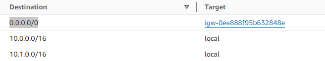

# VPC ( Virtual private cloud )
- single region -- > max: `5-VPC `
- single VPC --> max: `5-CIDR `
  - CIDR min ****/28 = 32-28 = 4 --> 2^4 = `16`
  - CIDR max ****/16 = 32-16 = 16 --> 2^16 = `65,536`
- VPC is `private` resource, referring only private IPs ranges.
- IMP : `Don't overlap CIDR`, if having multiple VPC **

---
## A. Key term
- CIDR/IP-range : `base-IP/fixed-bit (0-32)` 
- 0.0.0.0/0 : Any IP
- `Private IP`
  -  10.0.0.0 – 10.255.255.255 (10.0.0.0/8) : in big networks, will use this in demo within /28 - /16
  -  172.16.0.0 – 172.31.255.255 (`172.16.0.0/12`) : AWS default VPC in that range
  -  192.168.0.0 – 192.168.255.255 (192.168.0.0/16) : Home n/w

---
## B. default VPC : walkthrough
  - details:
    - CIDR-1 : `172.32.0.0/16`
    - CIDR-2,3,4,5 : can have
  - has/Contains:
    - `subnet`( found 4) : 4 az === 4 subnets 
      - each has it own IP CIDR.
        - eg: CIDR ****/27 = 2^5=32-5 = 27 available
      - first 4 and last IP  are reserved (`5-resevered in each subnet`) 
        - 1- `network address`
        - 2:reserved - `VPC router`
        - 3:reserved - mapping to aws provided `DNS`
        - 4:reserved - future use
        - last:reserved - `network broadcast address`, not supported currently.
      - `ACL`  (stateless / like sg)
        - Inbound rule
        - outbound rule
    - `route table`
      - Destination == target mapping
      - associated with all subnets 
    - `IGW`

---
## C. Demo: create new VPC
- region - us-west-2
- `vpc-1` : https://us-west-2.console.aws.amazon.com/vpcconsole/home?region=us-west-2#VpcDetails:VpcId=vpc-04ce2894d2f99bbb8
- add `IGW` (igw-0ee888f95b632848e, call it `igw-1`) to vpc-1 and `attach` to vpc-1
- route table:
  - `rtb-main` : gets created automatically with vpc.
    - will automatically get associated underlying subnet/s
  - `rtb-explicit/s` : can create and association to subnet.
      - create `rtb-explicit-1-private-vpc1` 
      - create `rtb-explicit-2-public-vpc1` : 
        - add route : client --> destination:publicIP 0.0.0.0/0 --> igw-1
        - VPC private CIDR --> local (within VPC)
        - 
  - `relation`:
    - VPC <--1-to-1--> rtb-main
    - underlying subnet/s <--1-to-1--> rtb-explicit/s or rtb-main:default
  - 

- add `subnet`
  - az-1 (us-west-2a)
    - vpc-1-subnet-`private`-1-us-west-2a
    - vpc-1-subnet-`public`-1-us-west-2a
      - link with `rtb-explicit-2-public-vpc1`.
      - contains:
        - `SG`
          - Ec2-i1(public IP-1)
  - az-2 (us-west-2b)
    - vpc-1-subnet-`private`-2-us-west-2b
    - vpc-1-subnet-`public`-2-us-west-2b

