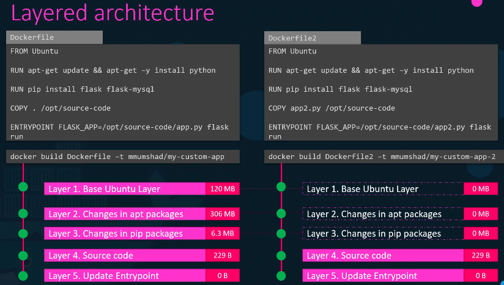
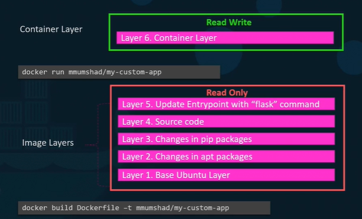
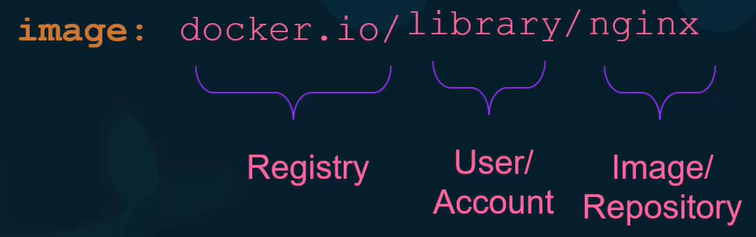
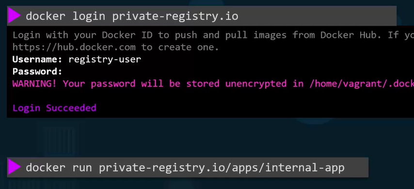

## layered arch

---
## Registry

---
## Container Security:
  - --user < userID >
  - --cap-add/drop < CAPABILITY >
  - Add these at:
    - container level :  
    - pod level :        
    - both present, container will override.

---
- pod-1
  - c1
    - process-1: port-1
    - process-2 : port-2
    - ...
  - c2
      - process-11 : port-11
      - process-22 : port-22
      - ...