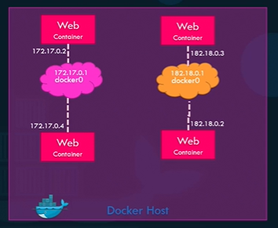
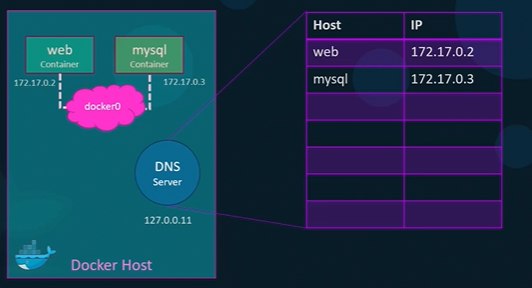

## network
- docker `inspect` <c1> : it will network details

### 1. bridge
- `project_dir_default` - one bridge n/w (default)
  - all containers are connected.
  - 
- can create many bridge n/w.
  - docker network create  --driver=bridge --subnet ... n1
  - 

- Embedded DNS
  - `privateIP` == containerName(act as hostname)
  - 
  
### 2. host

### 3. none
- c1 is not connected to host n/w + default n/w
- hence c1 cannot be exposed.
- c1 cannot connect to other container c2,c3,...

---

## Screenshots
